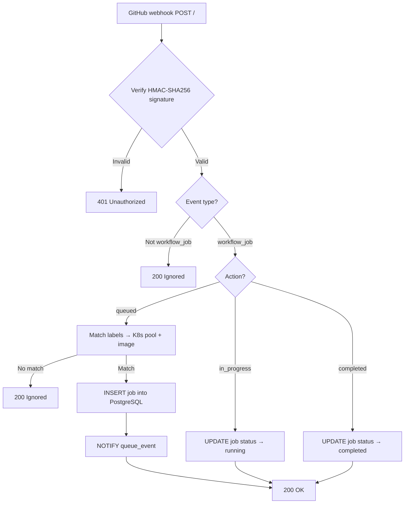

# Webhook Handler (`ghfe`)

The webhook handler (`ghfe`, the "GitHub front-end") receives GitHub `workflow_job` events, validates them, and records job state in PostgreSQL. It runs as a Flask application and is intentionally minimal: no GitHub API calls, no Kubernetes calls, just signature validation, label resolution, and a write to the database. Heavier work happens in the [scheduler](scheduler).

**Source:** [`container/ghfe.py`](https://github.com/riseproject-dev/riscv-runner-app/blob/main/container/ghfe.py)

## Request flow

## Signature validation

Every incoming request is verified using HMAC-SHA256 with the webhook secret. The handler computes `HMAC(secret, request_body)` and compares it against the `X-Hub-Signature-256` header. Invalid signatures are rejected with 401.

## Label matching

The handler extracts the `labels` array from the webhook payload and matches it against known RISC-V runner labels. Each label maps to:

- A **Kubernetes pool** (the value used as the `riseproject.dev/board` node selector).
- A **container image** (the runner image tag from the Scaleway registry).

If no label matches a known RISC-V runner, the webhook is ignored (`200 OK`). This lets the app coexist with other runner types in the same repository.

## PostgreSQL storage

Jobs and workers live in a `prod` or `staging` schema (the same database, isolated by `SET search_path`). The `jobs` table is the canonical record of demand:

| Column | Type | Purpose |
|---|---|---|
| `job_id` | `BIGINT` PK | GitHub job ID |
| `status` | `status_enum` | `pending` → `running` → `completed` (or `failed` for terminal cases) |
| `entity_id` / `entity_name` / `entity_type` | – | Organization or user identity |
| `repo_full_name` / `installation_id` | – | GitHub App context |
| `job_labels` | `JSONB` | Sorted at write time, used for demand matching |
| `k8s_pool` / `k8s_image` / `k8s_pod` | – | Resolved pool, image tag, and (later) provisioned pod name |
| `created_at` / `updated_at` | `TIMESTAMPTZ` | Lifecycle timestamps |

On `queued`, the handler `INSERT`s a row and emits `NOTIFY queue_event` so the scheduler wakes up immediately rather than waiting for its 15-second tick. On `in_progress` and `completed`, the handler updates `status` (forward-only). The full schema, including the `workers` table, is documented in [`riscv-runner-app/README.md`](https://github.com/riseproject-dev/riscv-runner-app/blob/main/README.md).

## Staging proxy

In production mode, webhooks for entities flagged as staging in `ENTITY_CONFIG` are forwarded to the staging handler URL. This allows a single GitHub App installation to serve both environments.

## HTTP endpoints

| Route | Method | Purpose |
|-------|--------|---------|
| `/` | POST | Webhook endpoint |
| `/health` | GET | Health check |
| `/usage` | GET | Live pool/job/worker statistics (HTML) |
| `/history` | GET | Job history grouped by entity and pool |

## Related files

- [`container/ghfe.py`](https://github.com/riseproject-dev/riscv-runner-app/blob/main/container/ghfe.py): webhook handler.
- [`container/db.py`](https://github.com/riseproject-dev/riscv-runner-app/blob/main/container/db.py): PostgreSQL operations.
- [`container/constants.py`](https://github.com/riseproject-dev/riscv-runner-app/blob/main/container/constants.py): entity configuration, label mappings.
