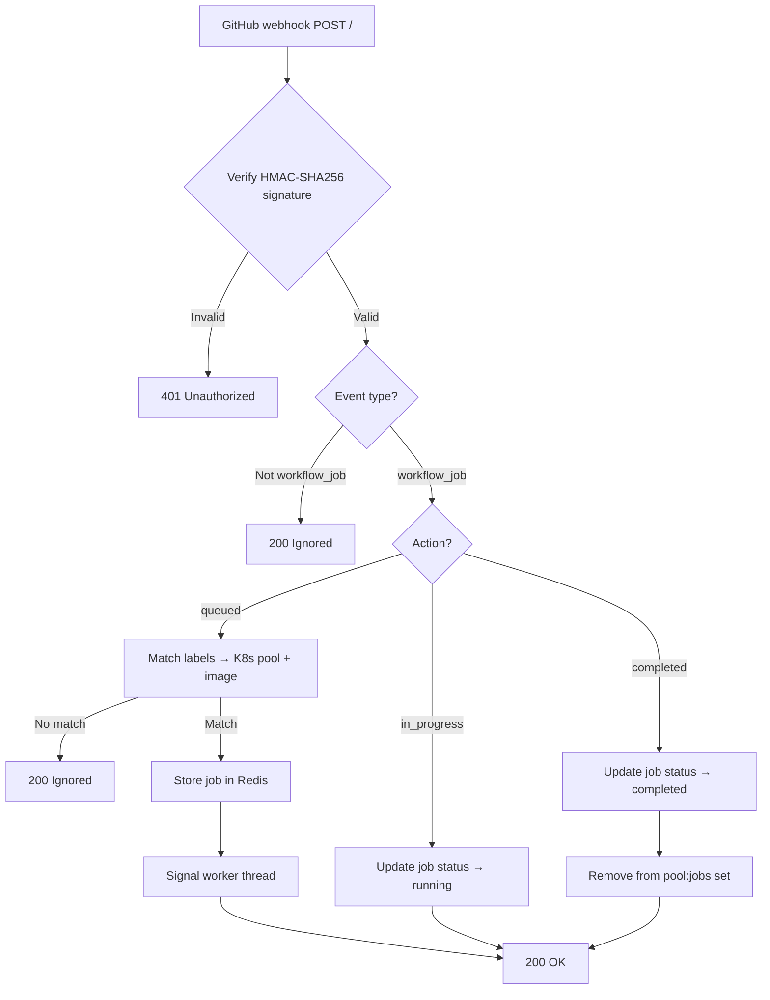

# Webhook Handler

The webhook handler receives GitHub `workflow_job` events, validates them, and records job demand in Redis. It runs as a Flask application on port 8080.

**Source:** [`container/handler.py`](https://github.com/riseproject-dev/riscv-runner-app/blob/main/container/handler.py)

## Request flow

## Signature validation

Every incoming request is verified using HMAC-SHA256 with the webhook secret. The handler computes `HMAC(secret, request_body)` and compares it against the `X-Hub-Signature-256` header. Invalid signatures are rejected with 401.

## Label matching

The handler extracts the `labels` array from the webhook payload and matches it against known RISC-V runner labels. Each label maps to:

- A **Kubernetes pool** (node selector value for `riseproject.dev/board`)
- A **container image** (runner image tag from the Scaleway registry)

If no label matches a known RISC-V runner, the webhook is ignored (200). This allows the app to be installed on repos that also use other runner types.

## Redis storage

Jobs are stored using two Redis structures:

| Key pattern | Type | Purpose |
|-------------|------|---------|
| `{env}:job:{job_id}` | Hash | Job metadata: status, entity_id, entity_type, labels, k8s_pool, created_at, repo, installation_id |
| `{env}:pool:{entity_id}:{k8s_pool}:jobs` | Set | Active job IDs for demand counting (pending + running) |

The `{env}` prefix is `prod` or `staging` depending on the deployment. The `entity_id` is the organization ID for org installations or the repository ID for personal account installations.

On `queued`: the handler creates the job hash and adds the job ID to the pool set.
On `in_progress`: the handler updates the job hash status to `running`.
On `completed`: the handler updates the job hash status to `completed` and removes the job ID from the pool set.

## Staging proxy

In production mode, webhooks from staging organizations are forwarded to the staging handler URL. This allows a single GitHub App installation to serve both environments.

## HTTP endpoints

| Route | Method | Purpose |
|-------|--------|---------|
| `/` | POST | Webhook endpoint |
| `/health` | GET | Health check |
| `/usage` | GET | Live pool/job/worker statistics (HTML) |
| `/history` | GET | Job history grouped by org and pool |

## Related files

- [`container/handler.py`](https://github.com/riseproject-dev/riscv-runner-app/blob/main/container/handler.py): webhook handler
- [`container/db.py`](https://github.com/riseproject-dev/riscv-runner-app/blob/main/container/db.py): Redis operations
- [`container/constants.py`](https://github.com/riseproject-dev/riscv-runner-app/blob/main/container/constants.py): entity configuration, label mappings
- [`container/serve.py`](https://github.com/riseproject-dev/riscv-runner-app/blob/main/container/serve.py): application entry point
