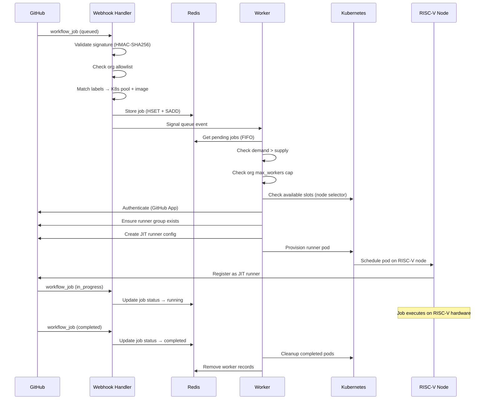

# Architecture Overview

[RISE RISC-V Runners](https://github.com/apps/rise-risc-v-runners) is a demand-driven autoscaling system that provisions ephemeral GitHub Actions runners on RISC-V Kubernetes nodes. The system spans four repositories, each handling a distinct concern.

## Repository map

| Repository | Language | Role |
|------------|----------|------|
| [riscv-runner-app](https://github.com/riseproject-dev/riscv-runner-app) | Python | Webhook handler, background worker, GitHub API integration |
| [riscv-runner-device-plugin](https://github.com/riseproject-dev/riscv-runner-device-plugin) | Go | Kubernetes device plugin (1 pod/node), node labeller (SoC detection) |
| [riscv-runner-images](https://github.com/riseproject-dev/riscv-runner-images) | Dockerfile | Runner image (Ubuntu + tools), DinD sidecar |
| [riscv-runner-sample](https://github.com/riseproject-dev/riscv-runner-sample) | YAML | Example workflows for end users |

## End-to-end flow

## Key design decisions

**Demand-driven provisioning.** Webhooks record demand (pending jobs in Redis). The worker creates supply (Kubernetes pods) to match. This separation keeps webhook responses fast — no GitHub API calls or Kubernetes operations on the webhook path.

**Ephemeral runners.** Each job gets a fresh pod. No state persists between jobs. Pods are deleted after completion by the worker's cleanup loop.

**One pod per node.** The device plugin advertises a single `riseproject.com/runner` resource per node. The Kubernetes scheduler enforces exclusive access — only one runner pod can be scheduled on each RISC-V node at a time.

**JIT runner registration.** Runners use GitHub's just-in-time configuration. The worker obtains a JIT config token from the GitHub API and passes it to the pod at creation time. The runner registers, executes one job, and exits.

**Board-based scheduling.** The node labeller reads the device tree on each RISC-V node, detects the SoC, and applies a `riseproject.dev/board` label. Runner pods use a `nodeSelector` to land on the correct hardware for each label.

## Components

- [Webhook Handler](handler) — request validation, label matching, Redis storage
- [Worker & Scheduling](worker) — reconciliation loop, demand matching, pod lifecycle
- [Kubernetes Infrastructure](kubernetes) — device plugin, node labeller, scheduling
- [Container Images](images) — runner image, DinD sidecar, build pipeline
