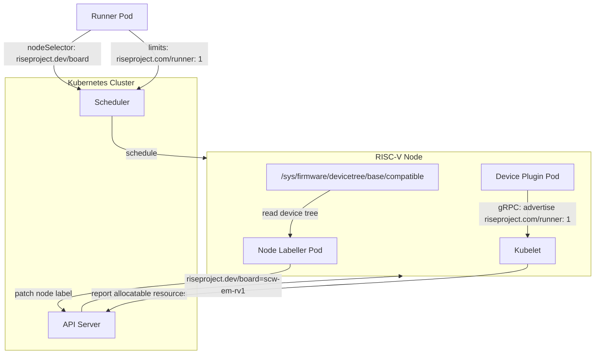

# Kubernetes Infrastructure

Two components run as DaemonSets on every RISC-V node in the cluster: the **device plugin** and the **node labeller**. Together, they enable board-specific scheduling with exclusive node access.

**Source:** [riscv-runner-device-plugin](https://github.com/riseproject-dev/riscv-runner-device-plugin)

## How it fits together



## Device plugin

The device plugin implements the Kubernetes Device Plugin API via gRPC. It advertises exactly **one** `riseproject.com/runner` resource per node.

Runner pods request this resource:

```yaml
resources:
  limits:
    riseproject.com/runner: "1"
```

Since only one unit exists per node, the Kubernetes scheduler will never place two runner pods on the same node. This enforces exclusive access without taints or manual coordination.

### How it works

1. The plugin starts and registers with kubelet via a Unix socket at `/var/lib/kubelet/device-plugins/rise-riscv-runner.sock`
2. `ListAndWatch()` advertises a single healthy device (`runner-0`) to the kubelet
3. `Allocate()` returns an empty response. No actual device allocation is needed; only the scheduling constraint matters
4. A file watcher monitors the kubelet socket directory and re-registers if kubelet restarts

### DaemonSet configuration

- **Namespace:** `kube-system`
- **Node selector:** `kubernetes.io/arch: riscv64`
- **Priority:** `system-node-critical`
- **Volume mount:** `/var/lib/kubelet/device-plugins` (host path)
- **Image:** `rg.fr-par.scw.cloud/funcscwriseriscvrunnerappqdvknz9s/riscv-runner:device-plugin-latest`

## Node labeller

The node labeller detects the SoC on each RISC-V node and applies a `riseproject.dev/board` label. Runner pods use this label in their `nodeSelector` to land on the correct hardware.

### SoC detection

1. Read `/sys/firmware/devicetree/base/compatible` (null-separated entries)
2. Match each entry against a built-in board map:

| Device tree compatible string | Board label |
|-------------------------------|-------------|
| `scaleway,em-rv1-c4m16s128-a` | `scw-em-rv1` |
| `sophgo,mango` | `cloudv10x-pioneer` |

3. If no known mapping exists, sanitize the first compatible entry (replace commas/spaces with hyphens, lowercase) and use that as the label

### DaemonSet configuration

- **Namespace:** `kube-system`
- **Node selector:** `kubernetes.io/arch: riscv64`
- **RBAC:** ServiceAccount with ClusterRole granting `get` and `patch` on nodes
- **Environment:** `NODE_NAME` from downward API (`spec.nodeName`)
- **Volume mount:** `/sys/firmware/devicetree/base` (read-only)
- **Privileged:** Yes (required for device tree access)
- **Image:** `rg.fr-par.scw.cloud/funcscwriseriscvrunnerappqdvknz9s/riscv-runner:node-labeller-latest`

## Source files

| File | Role |
|------|------|
| [`cmd/k8s-device-plugin/main.go`](https://github.com/riseproject-dev/riscv-runner-device-plugin/blob/main/cmd/k8s-device-plugin/main.go) | Device plugin entry point |
| [`pkg/plugin/plugin.go`](https://github.com/riseproject-dev/riscv-runner-device-plugin/blob/main/pkg/plugin/plugin.go) | gRPC server, kubelet registration, watchdog |
| [`cmd/k8s-node-labeller/main.go`](https://github.com/riseproject-dev/riscv-runner-device-plugin/blob/main/cmd/k8s-node-labeller/main.go) | Node labeller entry point |
| [`pkg/soc/detect.go`](https://github.com/riseproject-dev/riscv-runner-device-plugin/blob/main/pkg/soc/detect.go) | Device tree parsing and SoC → board mapping |
| [`pkg/labeler/labeler.go`](https://github.com/riseproject-dev/riscv-runner-device-plugin/blob/main/pkg/labeler/labeler.go) | Kubernetes API node label patching |
| [`k8s-ds-device-plugin.yaml`](https://github.com/riseproject-dev/riscv-runner-device-plugin/blob/main/k8s-ds-device-plugin.yaml) | Device plugin DaemonSet manifest |
| [`k8s-ds-node-labeller.yaml`](https://github.com/riseproject-dev/riscv-runner-device-plugin/blob/main/k8s-ds-node-labeller.yaml) | Node labeller DaemonSet + RBAC manifest |
