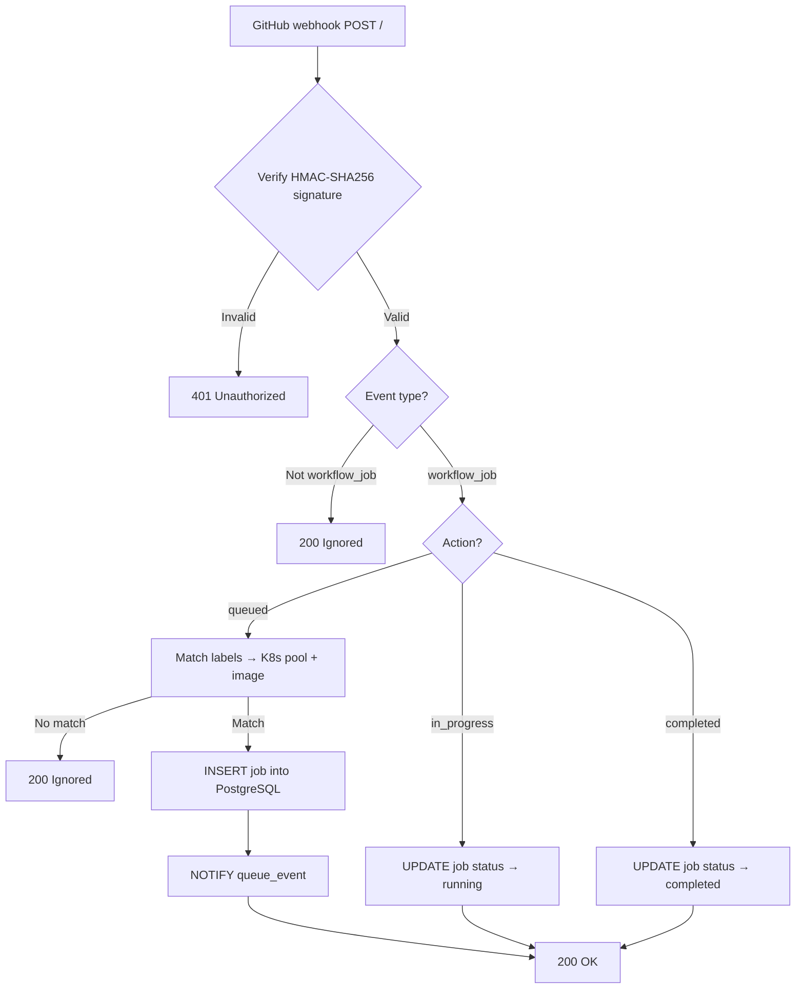

# Webhook Handler (`ghfe`)

The webhook handler (`ghfe`, the "GitHub front-end") receives GitHub `workflow_job` events, validates them, and records job state in PostgreSQL. It is a Go HTTP service built on `net/http` and `pgx`, intentionally minimal: no GitHub API calls, no Kubernetes calls, just signature validation, label resolution, and a write to the database. Heavier work happens in the [scheduler](scheduler).

**Source:** [`container/cmd/ghfe/`](https://github.com/riseproject-dev/riscv-runner/tree/main/container/cmd/ghfe)

## Request flow

Every accepted code path also writes one row into the `installation_events` table. See [Installation event log](installation-events).

## Signature validation

Every incoming request is verified with HMAC-SHA256 of the raw body against the `X-Hub-Signature-256` header, using a constant-time compare. The handler also requires `X-GitHub-Hook-Installation-Target-Id` so each event can be attributed to one of the two GitHub Apps (organization or personal).

## Event dispatch

The handler dispatches on `X-GitHub-Event`:

| Event | What `ghfe` does |
|---|---|
| `ping` | 200 OK; logs the row |
| `installation` (created / deleted / suspend / unsuspend) | Records the row; `installation.deleted` and `installation.suspend` have no other side effect |
| `installation_repositories` (added / removed) | Records the row |
| `installation_target` (renamed) | Records the row |
| `workflow_job` (queued / in_progress / completed) | DB write + `installation_events` row |

Unhandled `X-GitHub-Event` headers are recorded with `outcome=unhandled_event` and otherwise ignored.

## Label matching

`workflow_job.queued` invokes `matchLabelsToK8s(cfg, orgID, repoFullName, labels)` in [`container/cmd/ghfe/payload.go`](https://github.com/riseproject-dev/riscv-runner/blob/main/container/cmd/ghfe/payload.go). The current routing rules:

| Scope | Label | Pool | Image |
|---|---|---|---|
| Default | `ubuntu-24.04-riscv` | `scw-em-rv1` | `riscv-runner:ubuntu-24.04-latest` (or `-staging`) |
| GGML scope: `ggml-org/*`, `riseproject-dev/llama.cpp`, `riseproject-dev/llama.cpp-validation` | `ubuntu-24.04-riscv` | `cloudv10x-jupiter` | `riscv-runner:ubuntu-24.04-latest` (or `-staging`) |

The handler only matches single-label arrays containing `ubuntu-24.04-riscv` today. Anything else returns `(_, _, false)` and is ignored with `outcome=IGNORED_NO_LABEL`. New labels are added by extending `matchLabelsToK8s`.

## Staging proxy

In production mode, webhooks for entities flagged as staging in `EntityConfigs` are forwarded to `STAGING_URL` with the original body and headers. This lets a single GitHub App installation serve both environments: prod proxies the matching repositories to staging while continuing to handle everyone else itself.

## HTTP endpoints

| Route | Method | Purpose |
|-------|--------|---------|
| `/` | POST | Webhook endpoint for GitHub events |
| `/health` | GET | Health check (returns `ok`) |
| `/setup/org` | GET | Post-install landing page for organization installations |
| `/setup/personal` | GET | Post-install landing page for personal-account installations |
| `/trace/entity/{entity_id}` | GET | Installation event log for an entity (bearer auth) |
| `/trace/installation/{installation_id}` | GET | Resolves to `entity_id` then returns its event log (bearer auth) |
| `/trace/job/{job_id}` | GET | Resolves to `entity_id` via `jobs.entity_id` then returns its event log (bearer auth) |
| `/trace/payload/{event_id}` | GET | Full JSONB payload for one row (bearer auth) |

`/setup/*` is what GitHub redirects users to after they install the App. The handler reads `installation_id` from the query string, fetches the installation, and renders one of five outcomes: `missing`, `wrongApp`, `wrongType`, `installedOK`, `upstreamError`. The trace endpoints are gated by `Authorization: Bearer $TRACE_API_SECRET`; see [Installation event log](installation-events).

The service listens on port `8080`. Graceful shutdown on SIGINT/SIGTERM with a 10s drain.

## Persistence

Jobs and `installation_events` are written to PostgreSQL. The `jobs` table is the canonical record of demand; the `workers` table tracks supply (written by the scheduler, not by `ghfe`). Full schema and indexes: [Database schema](database).

On `workflow_job.queued`, the handler:

1. `INSERT`s a row into `jobs` with `ON CONFLICT (job_id) DO NOTHING` (so a redelivered webhook is a no-op).
2. The PostgreSQL trigger emits `NOTIFY {schema}_queue_event`. The scheduler `LISTEN`s on that channel and wakes immediately rather than waiting for its 15-second tick.

On `workflow_job.in_progress` and `workflow_job.completed`, the handler updates `status` with a `WHERE` clause that enforces forward-only transitions.

## Environment

`ghfe` reads:

| Variable | Purpose |
|---|---|
| `PROD` | `true` to use the `prod` schema and `*-latest` image tags, otherwise `staging` schema and `*-staging` tags |
| `PROD_URL`, `STAGING_URL` | URL of the prod/staging ghfe; used by the staging proxy |
| `POSTGRES_URL` | PostgreSQL connection string |
| `GHAPP_WEBHOOK_SECRET` | Shared HMAC secret used by both apps |
| `GHAPP_ORG_PRIVATE_KEY`, `GHAPP_PERSONAL_PRIVATE_KEY` | RSA private keys for the two GitHub Apps (PEM) |
| `TRACE_API_SECRET` | Bearer token gating `/trace/*` |
| `LOGLEVEL` | `DEBUG` / `INFO` / `WARN` / `ERROR` |

## Related files

- [`container/cmd/ghfe/main.go`](https://github.com/riseproject-dev/riscv-runner/blob/main/container/cmd/ghfe/main.go): server setup and route registration.
- [`container/cmd/ghfe/webhook.go`](https://github.com/riseproject-dev/riscv-runner/blob/main/container/cmd/ghfe/webhook.go): event dispatch and side-effect writes.
- [`container/cmd/ghfe/payload.go`](https://github.com/riseproject-dev/riscv-runner/blob/main/container/cmd/ghfe/payload.go): `matchLabelsToK8s` and payload trimming.
- [`container/cmd/ghfe/signature.go`](https://github.com/riseproject-dev/riscv-runner/blob/main/container/cmd/ghfe/signature.go): HMAC verification.
- [`container/cmd/ghfe/staging_proxy.go`](https://github.com/riseproject-dev/riscv-runner/blob/main/container/cmd/ghfe/staging_proxy.go): prod-to-staging forwarder.
- [`container/cmd/ghfe/setup.go`](https://github.com/riseproject-dev/riscv-runner/blob/main/container/cmd/ghfe/setup.go) and [`setup.gohtml`](https://github.com/riseproject-dev/riscv-runner/blob/main/container/cmd/ghfe/setup.gohtml): post-install landing pages.
- [`container/cmd/ghfe/trace.go`](https://github.com/riseproject-dev/riscv-runner/blob/main/container/cmd/ghfe/trace.go): trace endpoint implementations.
- [`container/internal/db.go`](https://github.com/riseproject-dev/riscv-runner/blob/main/container/internal/db.go): PostgreSQL operations.
- [`container/internal/github.go`](https://github.com/riseproject-dev/riscv-runner/blob/main/container/internal/github.go): GitHub App auth and REST client.
- [`container/internal/constants.go`](https://github.com/riseproject-dev/riscv-runner/blob/main/container/internal/constants.go): config, entity ID constants, `EntityConfigs`.
