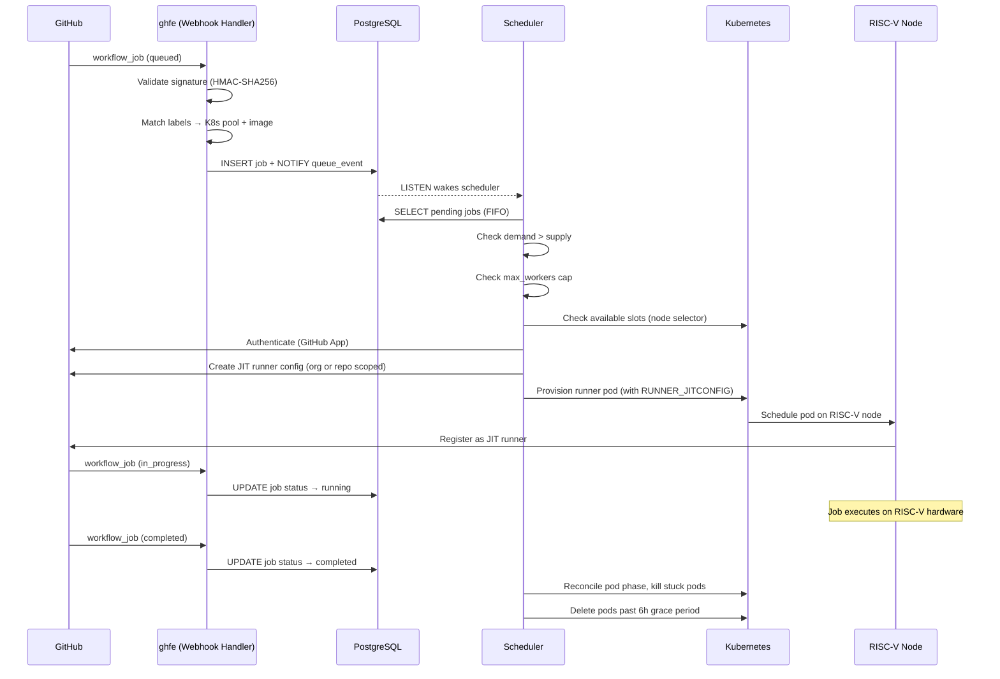

# Architecture Overview

[RISE RISC-V Runners](https://github.com/apps/rise-risc-v-runners) is a demand-driven autoscaling system that provisions ephemeral GitHub Actions runners on RISC-V Kubernetes nodes. The whole service lives in [`riseproject-dev/riscv-runner`](https://github.com/riseproject-dev/riscv-runner) and is split into a few top-level directories, each handling a distinct concern.

## Component map

| Directory | Language | Role |
|-----------|----------|------|
| [`control-plane/`](https://github.com/riseproject-dev/riscv-runner/tree/main/control-plane) | Go | Webhook handler (`ghfe`), scheduler, GitHub API integration |
| [`device-plugin/`](https://github.com/riseproject-dev/riscv-runner/tree/main/device-plugin) | Go | Kubernetes device plugin (1 pod/node), node labeller (SoC detection) |
| [`images/`](https://github.com/riseproject-dev/riscv-runner/tree/main/images) | Dockerfile | Runner image (Ubuntu + tools) |

A separate [`riscv-runner-sample`](https://github.com/riseproject-dev/riscv-runner-sample) repo holds example workflows for end users.

## End-to-end flow

## Key design decisions

**Demand-driven provisioning.** Webhooks record demand (pending jobs in PostgreSQL). The scheduler creates supply (Kubernetes pods) to match. This separation keeps webhook responses fast: no GitHub API calls or Kubernetes operations on the webhook path. The scheduler is woken by `LISTEN/NOTIFY` (or a 15s timeout) rather than polling.

**Ephemeral runners.** Each job gets a fresh pod. No state persists between jobs. Pods are kept for 6 hours after completion so logs and events remain inspectable, then deleted by the scheduler.

**One pod per node.** The device plugin advertises a single `riseproject.com/runner` resource per node. The Kubernetes scheduler enforces exclusive access: only one runner pod can be scheduled on each RISC-V node at a time.

**JIT runner registration.** Runners use GitHub's just-in-time configuration. The worker obtains a JIT config token from the GitHub API and passes it to the pod at creation time. For organizations, runners are registered in a dedicated runner group; for personal accounts, runners are registered at the repository level. The runner registers, executes one job, and exits.

**Two GitHub Apps.** Organizations and personal accounts use separate GitHub Apps. The org app uses organization-level runner registration (requires Self-hosted runners permission). The personal app uses repository-level runner registration (requires Administration permission). The worker selects the correct app and API path based on entity type.

**Board-based scheduling.** The node labeller reads the device tree on each RISC-V node, detects the SoC, and applies a `riseproject.dev/board` label. Runner pods use a `nodeSelector` to land on the correct hardware for each label.

## Components

- [Webhook Handler](ghfe): request validation, label matching, PostgreSQL writes.
- [Scheduler](scheduler): reconciliation loop, demand matching, pod lifecycle, dashboards.
- [Kubernetes Infrastructure](kubernetes): device plugin, node labeller, scheduling.
- [Container Images](images): runner image and build pipeline.
- [Database Schema](database): jobs, workers, installation events.
- [Installation Event Log](installation-events): audit trail and trace endpoints.
