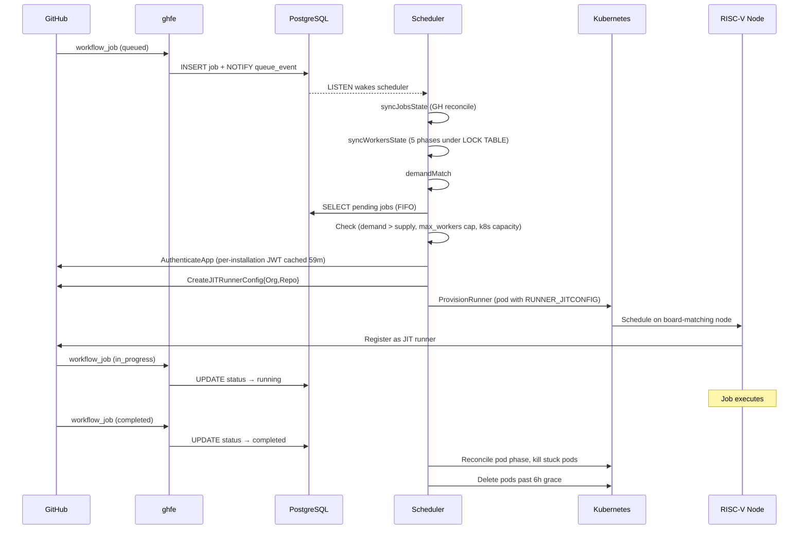

# Scheduler

The scheduler is a background Go service that runs a reconciliation loop. It matches pending job demand to available RISC-V node capacity, provisions runner pods, syncs worker state with Kubernetes and GitHub, and cleans up terminated pods. It also serves read-only HTML dashboards for jobs and workers.

**Source:** [`control-plane/cmd/scheduler/`](https://github.com/riseproject-dev/riscv-runner/tree/main/control-plane/cmd/scheduler)

## Reconciliation loop

The scheduler is woken by PostgreSQL `LISTEN/NOTIFY` (the [`ghfe`](ghfe) webhook handler emits a `{schema}_queue_event` notification when a new job is recorded) or by a 15-second timeout (`PollInterval`). Each iteration acquires the workers-table lock, runs three phases, then releases the lock:

1. **`syncJobsState`** — reconciles every active DB job against `GH.GetJobInfo`. If GitHub returns 404 the job is marked `failed`. If the job's parent run has completed but the job is still queued past `JobStuckQueuedMinAge` (10m), it is marked failed too. Reconcile writes also fill in `job_started_at`, `job_completed_at`, and `job_conclusion` for jobs that finished while the scheduler was not looking; `COALESCE` keeps the first non-null write wins.
2. **`syncWorkersState`** — single transaction holding `LOCK TABLE workers IN EXCLUSIVE MODE`, running five sub-phases (see below).
3. **`demandMatch`** — provisions new runner pods where demand exceeds supply.

Only one scheduler at a time may run `syncWorkersState`. If a second instance is deployed it blocks on the table lock until the first commits. The scheduler container's `serverless.yml` pins `minScale=1` and `maxScale=1` to keep that invariant trivially.



## Demand matching

Demand and supply are matched by `(entity_id, job_labels)`, not by pool. This avoids stuck workers when different label sets map to the same pool but the workflow expects matching runner labels.

```
demand  = COUNT(jobs    WHERE entity_id = ? AND job_labels = ? AND status IN ('pending','running'))
supply  = COUNT(workers WHERE entity_id = ? AND job_labels = ? AND status IN ('pending','running'))
deficit = demand - supply
```

For each pending job, processed FIFO by `created_at`:

1. **Demand check.** Skip if `supply >= demand`.
2. **Max-workers cap.** Skip if the entity (organization or personal account) has reached its configured limit across all pools. The default is `DefaultMaxWorkers = 20`; per-entity overrides live in `EntityConfigs` in [`internal/constants.go`](https://github.com/riseproject-dev/riscv-runner/blob/main/control-plane/internal/constants.go).
3. **Capacity check.** Query Kubernetes for available `riseproject.com/runner` slots on nodes matching the pool's `riseproject.dev/board` selector. Skip if no slots are free.
4. **Provision.** All checks pass:
   - `DB.AddWorker` reserves a unique runner name (retries on `ErrDuplicatePodName`).
   - `GH.AuthenticateApp` for the correct App (org or personal, chosen by entity type).
   - For organizations: `GH.EnsureRunnerGroup("RISE RISC-V Runners")`, then `GH.CreateJITRunnerConfigOrg`.
   - For personal accounts: `GH.CreateJITRunnerConfigRepo` (repo-scoped).
   - `K8s.ProvisionRunner` creates the pod.

A `failed` worker does not count toward supply, so the next loop iteration automatically re-provisions a runner for the same pending job.

## Pod provisioning

Runner pods are created via the Kubernetes API with:

- **Namespace:** `default`.
- **Labels:** `app=rise-riscv-runner`, `riseproject.dev/board=<pool>`.
- **Node selector:** `riseproject.dev/board: <pool>` (targets the correct hardware).
- **Resource limit:** `riseproject.com/runner: 1` (enforces one pod per node via the [device plugin](kubernetes)).
- **Ephemeral storage:** request 40 Gi, limit 90 Gi (on `scw-em-*` pools only).
- **Active deadline:** `525,600` seconds (~6 days). Patched to `1` to kill stuck pods (see Health checks).
- **Security context:** `privileged: true`, host network. Required by the in-pod Docker daemon to program iptables and bridge devices.
- **Environment:** `RUNNER_JITCONFIG` (base64 JIT token from GitHub), `RUNNER_WAIT_FOR_DOCKER_IN_SECONDS=60`.
- **Single container.** No init containers, no volumes. The image entrypoint launches the GitHub Actions runner directly. See [Container Images](images).

## `syncWorkersState` phases

Each iteration of `syncWorkersState` runs under `LOCK TABLE workers IN EXCLUSIVE MODE` so the five phases observe a consistent snapshot:

| Phase | Method | What it does |
|---|---|---|
| 1 | `OrphanSweep` | Worker rows with no matching k8s pod are marked terminal. |
| 2 | `PodPhaseSync` | Pod phase `Running` / `Succeeded` / `Failed` is reflected onto the worker status. `failure_info` is populated for failed pods. |
| 2.5 | `UnreachableNodeCheck` | Lists nodes tainted with `node.kubernetes.io/unreachable` and fails any worker whose pod is stranded on one. The pod is force-deleted so it does not sit in `Terminating` forever waiting on an absent kubelet. Skipped if the node-list call fails or returns no unreachable nodes. |
| 3 | `HealthChecks` | Per `(installation, entity_type, entity_id, repo)` fetches GH access tokens and runner lists; `classifyWorker` runs a state machine over each worker (see below). |
| 4 | `GitHubCleanup` | Deletes GH-registered runners whose worker row is terminal or missing. Org runners are scoped to the `RISE RISC-V Runners` runner group; repo runners are filtered by `rise-riscv-runner{-staging}-` name prefix. |
| 5 | `DeleteTerminalPods` | Deletes Succeeded/Failed pods past `PodDeleteGrace` (6h). |

### Health checks

Phase 3 runs a per-worker decision tree. Rather than deleting the pod directly, the scheduler patches `spec.activeDeadlineSeconds = 1`. The kubelet then transitions the pod to `Failed` (reason `DeadlineExceeded`), so it enters the normal grace-and-delete flow and logs/events remain inspectable.

- **`runner_never_registered`** — pod has been `Running` for more than `RunnerRegistrationTimeout` (120s) but the runner never appeared in the GitHub API. Worker is marked `failed` with full diagnostics in `failure_info`; pod is killed so its slot frees up for a retry.
- **`pod_stuck_pending`** — pod has been `Pending` for more than `PodPendingTimeout` (600s), typically due to missing capacity or an image-pull failure.
- **`runner_idle`** — runner is registered with GitHub, online, and not busy for longer than `RunnerPendingTimeout` (600s).

Phase 3 first tries to delete the GH-side runner. If GitHub refuses (e.g. `422 "Runner is busy"`), `syncWorkersState` aborts cleanup for that worker. GitHub believes a job is still running, so the worker is left alone and retried next cycle.

Phase 2.5 (`UnreachableNodeCheck`) handles the separate case of a pod on a node the kube node controller has marked unreachable. The kubelet is gone, so:

- **`node_unreachable`** — failure reason recorded on the worker. The pod is force-deleted (zero grace period) instead of patched, since patching `activeDeadlineSeconds` cannot be applied without a live kubelet. The GH runner row, now offline, is cleaned up by Phase 4 on a subsequent iteration.

## Lifecycle state machines

**Job:** forward-only `pending → running → completed | failed`. Every UPDATE enforces this with explicit `WHERE` clauses.

```
queued webhook      in_progress webhook     completed webhook
    │                       │                       │
    ▼                       ▼                       ▼
 pending  ────────────►  running  ────────────►  completed
    │                                               ▲
    └─────────────────── completed webhook ─────────┘
              (received before provisioning happened)
```

**Worker:** `pending → running → completed | failed`. Failures populate `failure_info`. Worker rows are never deleted; the row outlives the pod by the 6-hour grace period.

```
AddWorker            pod transitions               pod terminates
  reserves         ┌─► Running     ─► completed   (after 6h grace)
  pending row      │     ▲
                   │     │
                   ▼     │
                  Failed pod or
                  health-check kill
                       │
                       ▼
                    failed (failure_info populated)
```

## Configuration

| Setting | Value | Source |
|---|---|---|
| Poll interval | 15 s | [`internal/constants.go`](https://github.com/riseproject-dev/riscv-runner/blob/main/control-plane/internal/constants.go) (`PollInterval`) |
| Max workers per entity | Per-entity in `EntityConfigs`, else 20 | [`internal/constants.go`](https://github.com/riseproject-dev/riscv-runner/blob/main/control-plane/internal/constants.go) (`DefaultMaxWorkers`) |
| Pod active deadline | 525,600 s (~6 days) | [`internal/k8s.go`](https://github.com/riseproject-dev/riscv-runner/blob/main/control-plane/internal/k8s.go) |
| Pod delete grace | 6 h | `PodDeleteGrace` |
| Runner registration timeout | 120 s | `RunnerRegistrationTimeout` |
| Runner pending timeout | 600 s | `RunnerPendingTimeout` |
| Pod pending timeout | 600 s | `PodPendingTimeout` |
| Stuck-queued job age | 10 m | `JobStuckQueuedMinAge` |
| Postgres pool size | 10 | `PostgresMaxConn` |
| HTTP port | 8080 | `HTTPPort` |

## HTTP endpoints

The scheduler exposes read-only HTML dashboards on the same port (`8080`). Each page has a `.json` variant returning paginated JSON with a GitHub-style `Link` header (`page`, `per_page` defaults to 100; date filters: `start`, `end` accept `YYYY-MM-DD` or `-Xd`).

| Route | Method | Purpose |
|-------|--------|---------|
| `/health` | GET | Health check |
| `/usage`, `/usage.json` | GET | Live pool/job/worker view, grouped by `(entity_id, labels)` |
| `/history`, `/history.json`, `/jobs`, `/jobs.json` | GET | Job history sorted by status then `created_at` |
| `/workers`, `/workers.json` | GET | Worker history with `failure_info` |

`/history` and `/jobs` serve the same content; `/jobs` exists as a shorter alias.

## Related files

- [`control-plane/cmd/scheduler/main.go`](https://github.com/riseproject-dev/riscv-runner/blob/main/control-plane/cmd/scheduler/main.go): server, loop, `WithWorkerLock` wrapper.
- [`control-plane/cmd/scheduler/handlers.go`](https://github.com/riseproject-dev/riscv-runner/blob/main/control-plane/cmd/scheduler/handlers.go): HTTP routes.
- [`control-plane/cmd/scheduler/sync_jobs.go`](https://github.com/riseproject-dev/riscv-runner/blob/main/control-plane/cmd/scheduler/sync_jobs.go): GH reconcile, stuck-queued detection.
- [`control-plane/cmd/scheduler/sync_workers.go`](https://github.com/riseproject-dev/riscv-runner/blob/main/control-plane/cmd/scheduler/sync_workers.go): 5-phase pipeline and `classifyWorker`.
- [`control-plane/cmd/scheduler/demand_match.go`](https://github.com/riseproject-dev/riscv-runner/blob/main/control-plane/cmd/scheduler/demand_match.go): demand matching and provisioning.
- [`control-plane/cmd/scheduler/gh_auth.go`](https://github.com/riseproject-dev/riscv-runner/blob/main/control-plane/cmd/scheduler/gh_auth.go): `ghAuthenticate` wrapper and `auth_attempt.*` logging.
- [`control-plane/cmd/scheduler/templates.go`](https://github.com/riseproject-dev/riscv-runner/blob/main/control-plane/cmd/scheduler/templates.go): HTML rendering for dashboards.
- [`control-plane/internal/k8s.go`](https://github.com/riseproject-dev/riscv-runner/blob/main/control-plane/internal/k8s.go): pod provisioning, capacity checks, `CollectPodFailureInfo`.
- [`control-plane/internal/github.go`](https://github.com/riseproject-dev/riscv-runner/blob/main/control-plane/internal/github.go): GitHub App auth, JIT config, runner group / runner CRUD.
- [`control-plane/internal/db.go`](https://github.com/riseproject-dev/riscv-runner/blob/main/control-plane/internal/db.go): jobs / workers / events DB operations, `WithWorkerLock`.
- [`control-plane/internal/constants.go`](https://github.com/riseproject-dev/riscv-runner/blob/main/control-plane/internal/constants.go): all configuration and `EntityConfigs`.
